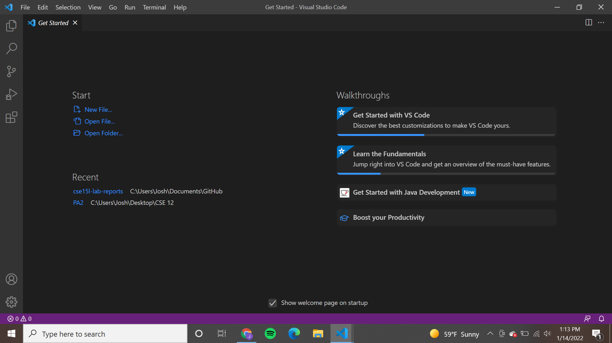
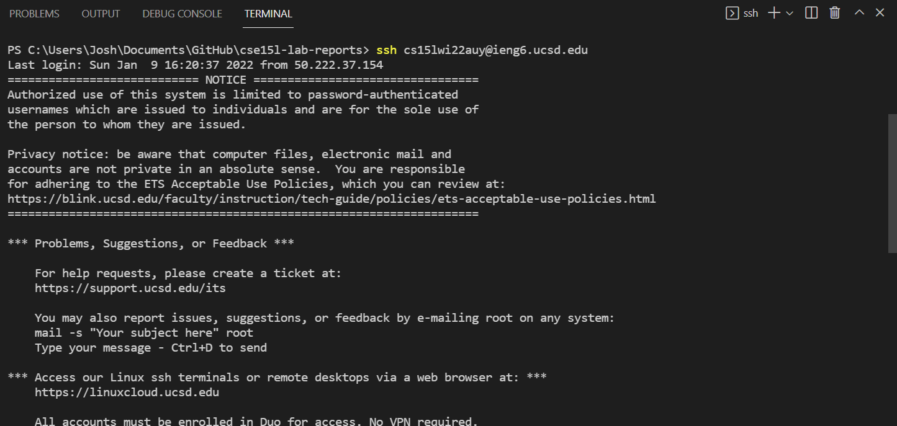
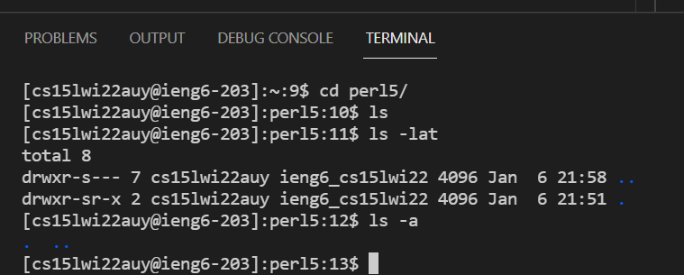
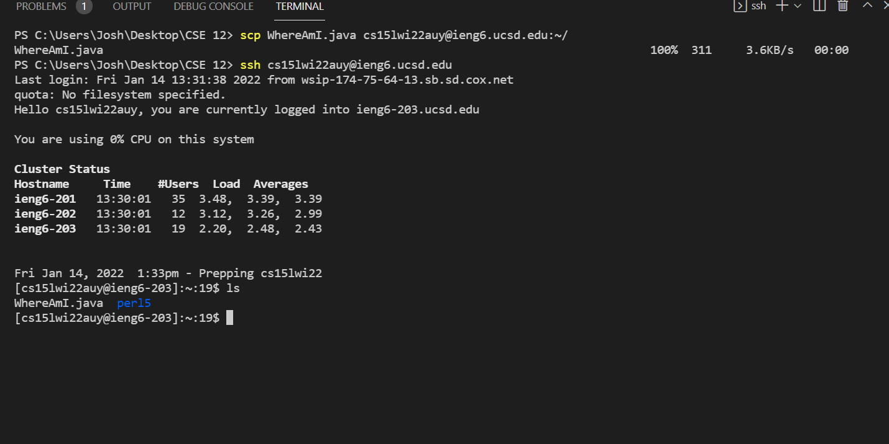
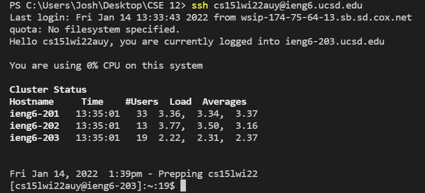
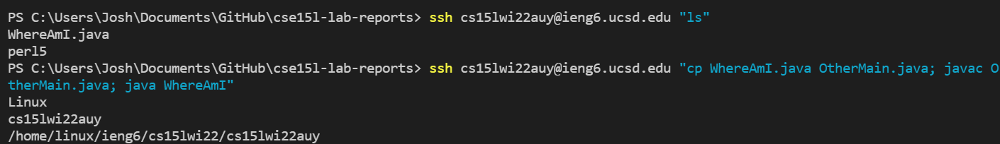

# Week 2 Lab Report


## Installing VSCode

* I went to the link provided in the Week 1 lab
    * [Visual Code Download Link](https://code.visualstudio.com/)
* Then I clicked the download for windows button 
* I allowed it to make changes on my computer and installed the program


## Remotely Connecting

* I first activated my class account by using the change my password link. This took a while because the website was not working properly, so I could not activate my account at first.
* I installed OpenSSH client on my laptop. OpenSSH server was alredy installed.
* After I activated my account, I logged in the terminal of VSCode using the `ssh` command.
```
ssh cs15lwi22auy@ieng6.ucsd.edu
```
* It asked for my password and once I put it in, I was logged on.


## Trying Some Commands

* I tried the `ls` command and that showed me a list of the directries I had the directory I was currently in.
```
ls
```
* Then I used `cd` to change directories to the subdirectory and ran `ls` again.
```
cd per15/
```
* I also tried `ls -lat` which gave me a list as well as the time that they were edited.
```
ls -lat
```

## Moving Files with `scp`

* First, I created a new file called WhereAmI.java and put in the contents given for the lab
* Then I ran the `scp` command to copy the file into the remote server. 
* Then I logged on to the remote server using `ssh` and `ls` to check if the file was copied to the server
```
scp WhereAmI.java cs15lwi22auy@ieng6.ucsd.edu:~/
ssh cs15lwi22auy@ucsd.edu
ls
```


## Setting an SSH Key

* Fist I created a key for my client using `ssh-keygen` command.

```
ssh-keygen
```

* When it asked for a file to save the key, I followed the format given for the lab, and gave no passphrase. It ended with a randomart image.
* I then logged into the remote server and used `mkdir` to create a new directory .ssh.

```
ssh cs15lwi22auy@ieng6.ucsd.edu
mkdir .ssh
```

* Then I logged out of the server and used the format on the lab site to, using `scp` to create a copy of the SSH Key in the server. 
* Now when I log in, I don't need to input my password everytime! That saves alot of time!


## Optimizing Remote Running

* I tried the two commands given in the lab writeup. The first one showed me what was in the directory of my server. The second one made a copy of `WhereAmI.java` into another file `OtherMain.java`. 
```
ssh cs15lwi22auy@ieng6.ucsd.edu "ls"
ssh cs15lwi22auy@ieng6.ucsd.edu "cp WhereAmI.java OtherMain.java; javac Othermain.java; java WhereAmI"
```
* Something interesting I found was that I do not go into the server when I ran those commands. I stayed in the client while running the commands. This can be helpful in PAs becuase I dont have to have a separate line of code for `ssh` and `scp`. Also that means I can compile and run java using the remote server as well!
