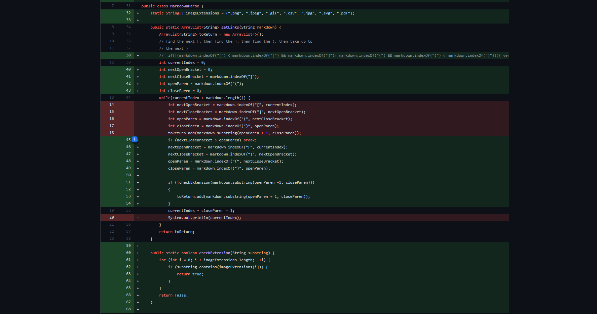
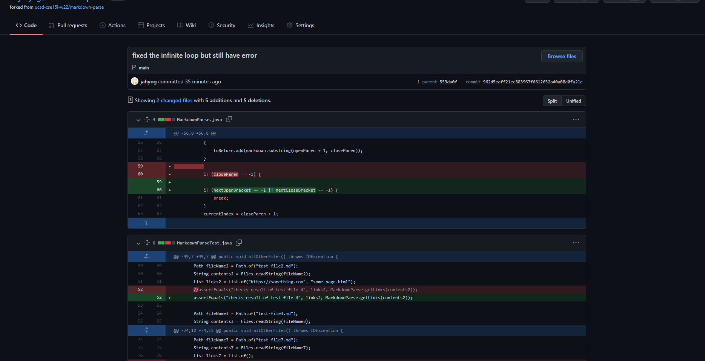
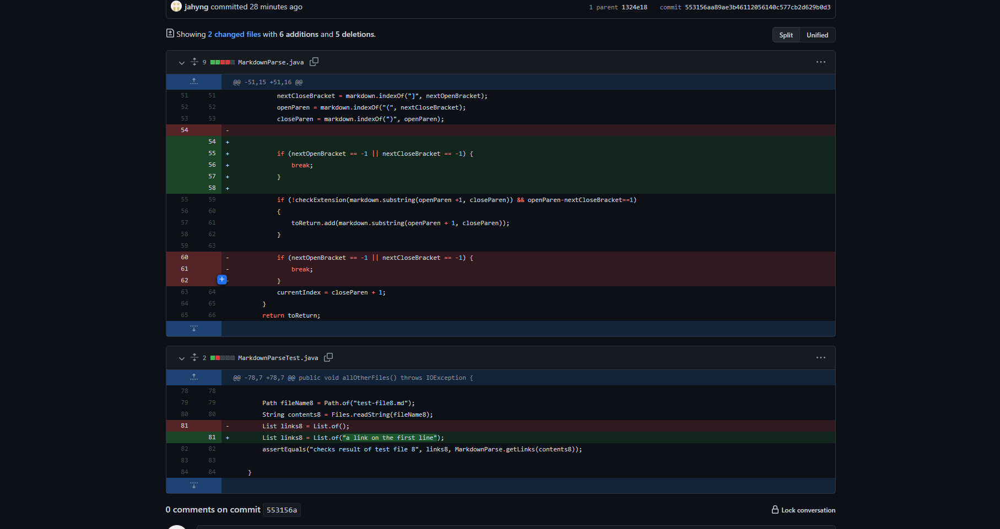

# Lab report 2

## Github change 1
> This is the code that fixed the infinite loop. We worked on this code as a group, and this is my own copy of it. 



[Link to the file that caused the error](https://github.com/jahyng/markdown-parse/blob/553156aa89ae3b46112056140c577cb2d629b0d3/test2-file.md)

> The output that the error inducing code produced was an infinite loop of 7s. It would be too much to put the actual output on the site. 

> What I think happened was what the variable `nextOpenBracket` was not set before the loop started, so it was not set. This caused the infinite loop because the code was looking for the `[` symbol starting after index 0. Because the `[` symbol was at index 0, it could not find it and therefore kept going in an infinite loop becuase if `nextOpenBracket` is not updated, none of the other variables will be updated either. 


---

## Github Fix 2

> This is the code that fixed an infinite loop



[Link to the error inducing code](https://github.com/jahyng/markdown-parse/blob/553da0fbbeaa9b9ed5ef8a212f18b7e655d3e3f5/MarkdownParseTest.java)

[Link to test2-file.md](https://github.com/jahyng/markdown-parse/blob/553156aa89ae3b46112056140c577cb2d629b0d3/test-file2.md)

> This is what the error produced

```
PS C:\Users\Josh\Documents\GitHub\markdown-parse> javac -cp ".;lib\junit-4.13.2.jar;lib\hamcrest-core-1.3.jar" MarkdownParseTest.java
PS C:\Users\Josh\Documents\GitHub\markdown-parse>  java -cp ".;lib/junit-4.13.2.jar;lib/hamcrest-core-1.3.jar" org.junit.runner.JUnitCore MarkdownParseTest
JUnit version 4.13.2
....
PS C:\Users\Josh\Documents\GitHub\markdown-parse>
```
> What I think happened was the while loop was going on infinietly because the variable `nextOpenBracket` was set to -1 becuase the defualt value for when the symbol cannot be found is -1. I added an if statement that would break out of the while loop if `nextOpenBracket` or `nextCloseBracket` were -1. This stopped the occurence of an infinite loop. However, now there is a problem with what the markdown copies. This is the topic of the next fix. 

---

## Github Fix 3

> This is the changed code that fixed the incorrect output error. 



[Link to the error inducing code](https://github.com/jahyng/markdown-parse/blob/962d5eaff21ec883967f6612652a40a08d0fa21e/MarkdownParse.java)

[Link to test2-file.md](https://github.com/jahyng/markdown-parse/blob/553156aa89ae3b46112056140c577cb2d629b0d3/test-file2.md)

> This is what the error produced

```
PS C:\Users\Josh\Documents\GitHub\markdown-parse>  java -cp ".;lib/junit-4.13.2.jar;lib/hamcrest-core-1.3.jar" org.junit.runner.JUnitCore MarkdownParseTest
JUnit version 4.13.2
....E
Time: 0.016
There was 1 failure:
1) allOtherFiles(MarkdownParseTest)
java.lang.AssertionError: checks result of test file 2 expected:<[https://something.com, some-page.html]> but was:<[https://something.com, some-page.html, https://something.com]>
        at org.junit.Assert.fail(Assert.java:89)
        at org.junit.Assert.failNotEquals(Assert.java:835)
        at org.junit.Assert.assertEquals(Assert.java:120)
        at MarkdownParseTest.allOtherFiles(MarkdownParseTest.java:52)

FAILURES!!!
Tests run: 4,  Failures: 1
```
> The error was that it copied the first link again. This is an issue with `MarkdownParse.java`, not the tester. It copied the first link one more time at the end. This means that the loop is not breaking before it loops again. To fix this, I moved the if statement above the if statement that calls the `checkExtensions` method. This made all the tests pass.