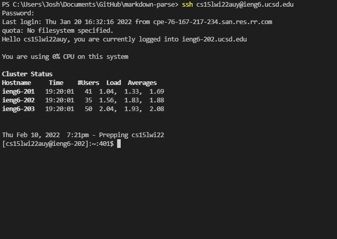
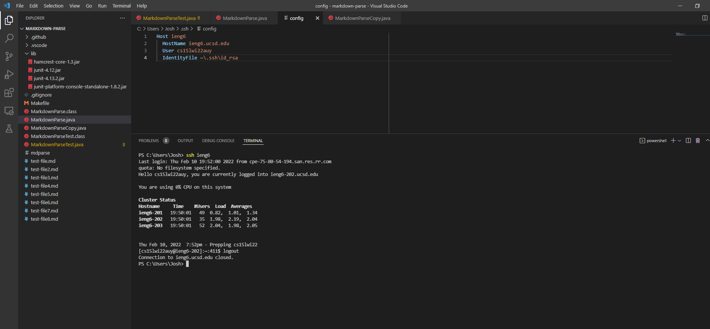
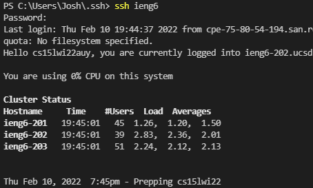
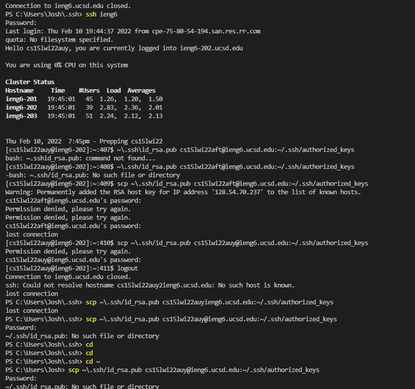
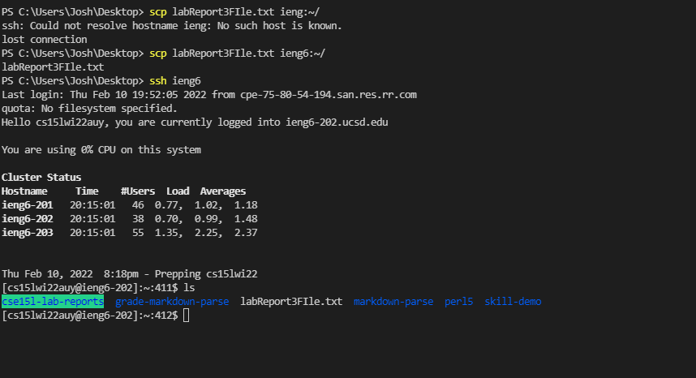

# Lab Report 3
## Logging into remote server using SSH


> This is a pictue of what I do to log into the remote server. 
1) First I run the command 
```
ssh cs15lwi22auy@ieng6.ucsd.edu
```

2) Then I am prompted to enter my passowrd for my specific class account. 
```
Password:
```
3) I enter my password correctly and a message welcoming to the remote server appears
```
Hello cs15lwi22auy, you are currently logged into ieng6-202.ucsd.edu

You are using 0% CPU on this system

Cluster Status
Hostname     Time    #Users  Load  Averages
ieng6-201   19:20:01   41  1.04,  1.33,  1.69
ieng6-202   19:20:01   35  1.56,  1.83,  1.88
ieng6-203   19:20:01   50  2.04,  1.93,  2.08


Thu Feb 10, 2022  7:21pm - Prepping cs15lwi22
```

---

## Putting code in config file


This image shows that I have added the block of code given by the lab page to 
the config file.

```
Host ieng6
  HostName ieng6.ucsd.edu
  User cs15lwi22auy
  IdentityFile ~\.ssh\id_rsa
```
For some reason before, I was still forced to use my passowrd when I used the 
`ssh` command. 



I realized that I did not have a SSH key from my computer and so I went through
the process of making one for the remote server using the steps from lab 1.



As seen in the first image of this section, I do not need to use my password to 
log in any more. 

---

## SCP command


This is an image of me using `scp` and `ieng6` to copy a text file to the 
server. 