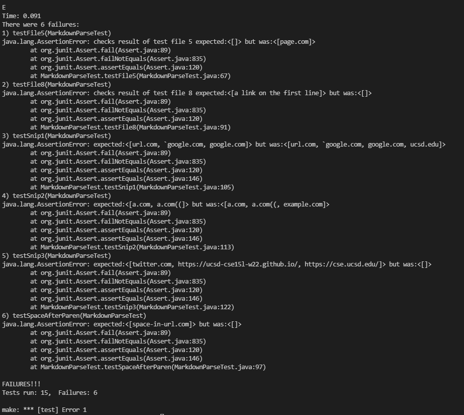
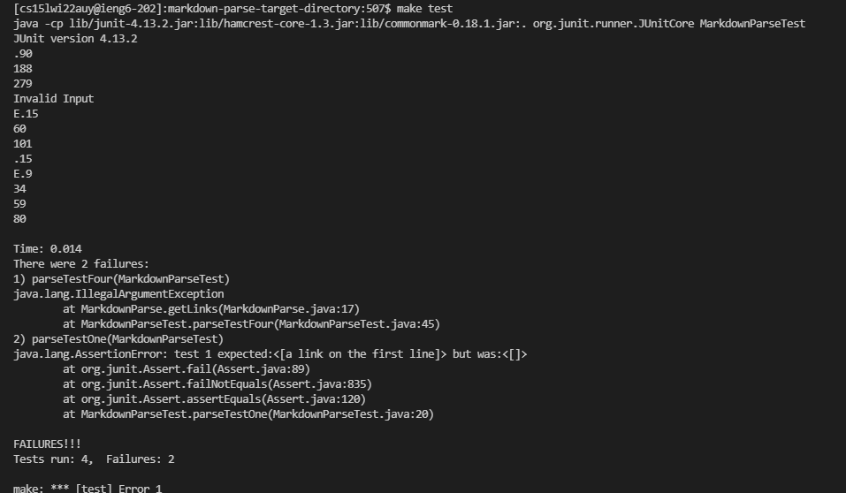

# Week 8 Lab Report

## My Own Implementaion
[Link to my own implementation](https://github.com/jahyng/markdown-parse.git)
```
@Test
    public void testSnip1() throws IOException {
        Path fileSnip1 = Path.of("report4Snip1.md");
        String contentSnip1 = Files.readString(fileSnip1);
        List linksSnip1 = List.of("url.com","`google.com");
        assertEquals(linksSnip1, MarkdownParse.getLinks(contentSnip1));
    }

    @Test 
    public void testSnip2() throws IOException {
        Path fileSnip = Path.of("report4Snip2.md");
        String contents = Files.readString(fileSnip);
        List<String> links  = List.of("a.com","b.com");
        assertEquals(links, MarkdownParse.getLinks(contents));
    }

    @Test
    public void testSnip3() throws IOException {
        Path fileSnip = Path.of("report4Snip3.md");
        String contents = Files.readString(fileSnip);
        List<String> links = List.of("twitter.com",
            "https://ucsd-cse15l-w22.github.io/","https://cse.ucsd.edu/");
        assertEquals(links, MarkdownParse.getLinks(contents));
    }
```

> I had three files in the directory named `report4Snip1.md`, `report4Snip2.md`, and `report4Snip3.md`. I used those files for the tests. The code above is how I tested the method. There are multiple tests so that I can easily distinguish which test failed. 

> report4Snip1.md code :
```
`[a link`](url.com)

[another link](`google.com)`

[`cod[e`](google.com)

[`code]`](ucsd.edu)
```

> report4Snip2.md code:
```
[a [nested link](a.com)](b.com)

[a nested parenthesized url](a.com(()))

[some escaped \[ brackets \]](example.com)
```

> report4Snip3.md code:
```
[this title text is really long and takes up more than 
one line

and has some line breaks](
    https://www.twitter.com
)

[this title text is really long and takes up more than 
one line](
    https://ucsd-cse15l-w22.github.io/
)

[this link doesn't have a closing parenthesis](github.com
And there's still some more text after that.

[this link doesn't have a closing parenthesis for a while](https://cse.ucsd.edu/


)

And then there's more text
```
---

> There were a total of 15 tests and there were 6 failures. All 3 tests for the different snips failed. There are other failures as well. For the  failure, the JUnit output is:
```
5) testSnip3(MarkdownParseTest)
java.lang.AssertionError: expected:<[twitter.com, https://ucsd-cse15l-w22.github.io/, https://cse.ucsd.edu/]> but was:<[]>
        at org.junit.Assert.fail(Assert.java:89)
        at org.junit.Assert.failNotEquals(Assert.java:835)
        at org.junit.Assert.assertEquals(Assert.java:120)
        at org.junit.Assert.assertEquals(Assert.java:146)
        at MarkdownParseTest.testSnip3(MarkdownParseTest.java:122)
```

## Reviewed Implementation
[Link to reviewed implementation](https://github.com/5ean-github/markdown-parse)

```
    @Test 
    public void parseTestTwo() throws IOException {
        Path fileSnip = Path.of("snip1.md");
        String contents = Files.readString(fileSnip);
        List<String> test = List.of("url.com","`google.com");
        assertEquals(test, MarkdownParse.getLinks(contents));
    }

    @Test
    public void parseTestThree() throws IOException {
        Path fileSnip = Path.of("snip2.md");
        String contents = Files.readString(fileSnip);
        List<String> test = List.of("a.com","b.com");
        assertEquals(test, MarkdownParse.getLinks(contents));
    }

    @Test
    public void parseTestFour() throws IOException {
        Path fileName = Path.of("snip3.md");
        String contents = Files.readString(fileName);
        List<String> test = List.of("twitter.com",
            "https://ucsd-cse15l-w22.github.io/","https://cse.ucsd.edu/");
        assertEquals(test, MarkdownParse.getLinks(contents));
    }    
```
> I made three md files that had the names `snip1.md`, `snip2.md`, and `snip3.md`. I used those files for the tests. The code above is how I created test methods. 

> report4Snip1.md code :
```
`[a link`](url.com)

[another link](`google.com)`

[`cod[e`](google.com)

[`code]`](ucsd.edu)
```

> report4Snip2.md code:
```
[a [nested link](a.com)](b.com)

[a nested parenthesized url](a.com(()))

[some escaped \[ brackets \]](example.com)
```

> report4Snip3.md code:
```
[this title text is really long and takes up more than 
one line

and has some line breaks](
    https://www.twitter.com
)

[this title text is really long and takes up more than 
one line](
    https://ucsd-cse15l-w22.github.io/
)

[this link doesn't have a closing parenthesis](github.com
And there's still some more text after that.

[this link doesn't have a closing parenthesis for a while](https://cse.ucsd.edu/


)

And then there's more text
```
---

> This code above is the results of the tests when for the reveiwed implementaion. The first two tests pass, but the third test, which is `parseTestFour`. 

```
1) parseTestFour(MarkdownParseTest)
java.lang.IllegalArgumentException
        at MarkdownParse.getLinks(MarkdownParse.java:17)
        at MarkdownParseTest.parseTestFour(MarkdownParseTest.java:45)
```

## Questions
### **Do you think there is a small (<10 lines) code change that will make your program work for snippet 1 and all related cases that use inline code with backticks? If yes, describe the code change. If not, describe why it would be a more involved change.**
I think that a small fix I could do is skip the index with backticks. As the code is iterating through the file, if it is a backtick, it will just skip the backtick and disregard it. 
___
### **Do you think there is a small (<10 lines) code change that will make your program work for snippet 2 and all related cases that nest parentheses, brackets, and escaped brackets? If yes, describe the code change. If not, describe why it would be a more involved change.**

I think that a small fix is to have an if statment if the next symbol after the open bracket is another one, there can be a recusive call or something to find the nested link. 
___
### **Do you think there is a small (<10 lines) code change that will make your program work for snippet 3 and all related cases that have newlines in brackets and parentheses? If yes, describe the code change. If not, describe why it would be a more involved change.**

I think it may be a more involved fix to figure out if the next indexes are empty lines or not. First it has to determine if the next character is a space, or a whole line and then it has to skip the lines to create the link. 