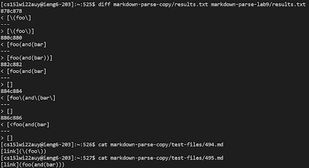

# Week 10 Lab Report

## How did you find the tests with different results?
* There is a directory called `test-files` with tons of test md files 
* In the file `script.sh` there is a loop that goes through every file in the directory test files. Here is the code for `script.sh`:
```
for file in test-files/*.md;
do
  echo $file
  java MarkdownParse $file
done
```
* In the terminal, I ran the command `bash script.sh > results.txt`. This puts all of the file names and the results of the tests for each file into a the text file `results.txt` instead of just dumping it in the terminal
* I then ran the command `diff markdown-parse-copy/results.txt markdown-parse-lab9/results.txt`. From the image below, there are 5 differences between the two implementations.


## Which implementaion, if any, is correct?
### First error
> For the error:
```
878c878
< [\(foo\]
---
> [\(foo\)]
```
> Line 878 corresponds to test file `494.md` which is 
```
[link](\(foo\))
```
> I think my implementation is correct because the last closed parenthesis is not part of the link and should not be counted. It is just another character outside of the link

> For the incorrect implementation, this line of code is what is preventing the link from parsiing:
```
 // The close paren we need may not be the next one in the file
            int closeParen = findCloseParen(markdown, openParen);
```
> This line looks for the closing paren that matches every one of the open parens. However, there is one less closed paren, so the link is never parse and is never added to the list.   
---
### Second error
> For the error:
```
880c880
< [foo(and(bar]
---
> [foo(and(bar))]
```
> Line 880 corresponds to test file `495.md` which is: 
```
[link](foo(and(bar)))
```
> I think my implementation is correct because the other parentheses after the first closing parenthesis are just characters outside of the link. However the other implmenetation adds them to the link.

> For the incorrect implementation, this line of code is what is preventing the link from parsiing:
```
 // The close paren we need may not be the next one in the file
            int closeParen = findCloseParen(markdown, openParen);
```
> This line looks for the closing paren that matches every one of the open parens. However, there is one less closed paren, so the link is never parse and is never added to the list. 
---
### Third error
> For the error: 
```
882c882
< [foo(and(bar]
---
> []
```
> Line 882 corresponds to test file `496.md` which is:
```
[link](foo(and(bar))
```
> I think my implementaion is correct because `foo(and(bar)` is a link, but the other implementation did not register it as such.

> For the incorrect implementation, this line of code is what is preventing the link from parsiing:
```
 // The close paren we need may not be the next one in the file
            int closeParen = findCloseParen(markdown, openParen);
```
> This line looks for the closing paren that matches every one of the open parens. However, there is one less closed paren, so the link is never parse and is never added to the list. 
---
### Fourth error
> For the error:
```
884c884
< [foo(\(and\(bar\]
---
> []
```
> Line 884 corresponds to test file `497.md` which is:
```
[link](foo\(and\(bar\))
```
> I think that my implementations is correct becuase there is a link, but the other implementation does not register it as such

> For the incorrect implementation, the line of code that is preventing thet link from parsing is:
```
 // The close paren we need may not be the next one in the file
            int closeParen = findCloseParen(markdown, openParen);
```
> This line looks for the closing paren that matches every one of the open parens. However, there is one less closed paren, so the link is never parse and is never added to the list. 
---
### Fifth error
> For the error:
```
886c886
< [<foo(and(bar]
---
> []
```
> Line 886 corresponds to test file `498.md` which is:
```
[link](<foo(and(bar)>)
```
> I think my implementation is correct because `<foo(and(bar)>` is a link, but the other implementation does not register it as such

> For the incorrect implementation, this line of code is what is preventing the link from parsiing:
```
 // The close paren we need may not be the next one in the file
            int closeParen = findCloseParen(markdown, openParen);
```
> This line looks for the closing paren that matches every one of the open parens. However, there is one less closed paren, so the link is never parse and is never added to the list. 